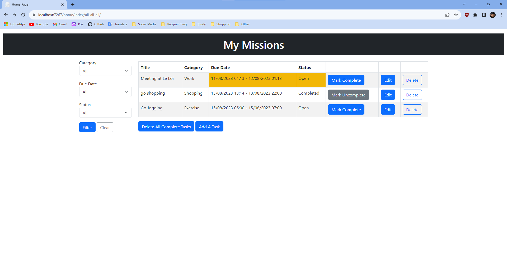

# ToDoListApp Web Application

Everyone always has at least one toy project so why not :>

I build this project only for practice which is again this is a toy project, some of them may not be best practice.
The ToDoList web application is a simple task management tool that allows users to create, update, and manage their to-do 
tasks. This application provides an intuitive user interface for organizing tasks and keeping track of progress.



## How to use it

1. Clone the repository
```powershell
git clone https://github.com/keilar000/ToDoListApp.git
```
2. Set up the database
    - In Visual Studio, open the Package Manager Console and run the following command.
    ```powershell
    Update-Database
    ```
    - In Visual Studio Code, open your terminal and run the command.
    ```powershell
    dotnet ef database update
    ```
3. Build and run the application

## Features

- Create new tasks with a title, category, due date, and status.
- Mark tasks as completed or uncompleted.
- Edit existing tasks to update their details.
- Delete tasks that are no longer needed.
- Delete all tasks that are completed.
- Automatically sort tasks by due date (start time).
- Responsive design for optimal usage on different devices.